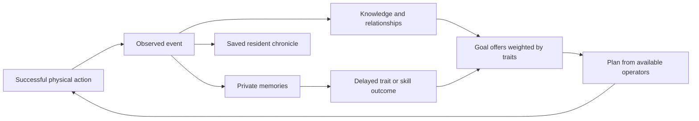

# Extending NPC systems

NPC mechanics live under `WRogue/Gameplay/Npc/`. Runtime services evaluate
registered contracts; feature modules own their content and policies. The
namespace remains `djack.RogueSurvivor.Gameplay.Personality` because saved
worlds identify existing types by their full name.

## Ownership and flow

| Directory | Responsibility |
| --- | --- |
| `Contracts/` | Module, goal source, trait, memory, value, capability and operator contracts |
| `Content/<feature>/` | Registration, belief updates, goal offers, action bindings and responses for one mechanic |
| `Knowledge/` | Observed or communicated snapshots, their age, source and confidence |
| `Goals/` | Evaluate offers, compare utility, keep/cancel goals, apply cooldowns |
| `Planning/` | Bounded search, binding validation, legal execution and replanning |
| `Events/` | Payload validation, observation phases and archive descriptions |
| `Memories/` | One creation/evidence/relationship-attribution path and delayed outcomes |
| `Relationships/` | Opinion arithmetic, reputation and spoken replies |
| `Runtime/` | Catalog composition, event delivery, clocks and story admission/reservations |

The story director admits and links independently motivated participants,
reserves roles/resources and records actual outcomes. It does not implement
food, medicine, theft or other action mechanics. A plan's predicted effects
are search state; only a performed legal action changes the world.

## One module, one composition entry

Implement `INpcContentModule.Register(NpcCatalogBuilder)` in the feature's
directory. Keep registration together; split larger action/perception helpers
by responsibility. Add the module once in `Content/NpcContentDefaults.cs`.
New definitions do not require adding branches to the generator, planner,
event dispatcher or records reader.

For a complete working example, see
[`NpcRestContent.cs`](../tests/scenarios/NpcRestContent.cs). In one file it
registers a trait, a valued state, a goal source, a capability, an operator,
an event and a memory with a delayed advanced-trait outcome. Its action calls
the real `DoWait`, then publishes the stamina actually recovered. The ordinary
civilian controller selects it in `npc/content-module`.

| API | Content owned by the module |
| --- | --- |
| `Trait`, `Memory` | Decision-axis effects, prerequisites, triggers, evidence and ordered outcomes |
| `Value` | Stable desired-state ID, trait/opinion-based importance, identity suffix and satisfaction/cooldown policies |
| `GoalSource` | `Evaluate(context, offers)`: current/desired state, subject, deficit, confidence and causes |
| `Capability` | Duration, acceptance/interruption policies, desired facts, optional direct action and speech |
| `OperatorSource` | Facts produced, prerequisite facts, availability and binding of operators to known places/people |
| `Operator` | Stable action ID, execution factory, resource and unavailable-binding correction |
| `Fact` | Named symbolic condition/effect used by the planner |
| `PlanSeed` | Initial planning facts and operators available across capabilities |
| `Interest` | Long lived, bounded personal priorities refreshed from the owner's known state |
| `Collective` | Group or faction proposal, eligible listener, speech and independent acceptance |
| `Resource`, `FactionPolicy` | Resource needs and faction preferences for supply, shelter, care and security |
| `Event` | Payload contract, audience, archive categories/prose, retained knowledge and story progress |
| `Perception`, `OnReport` | Feature belief updates from visible state or a communicated fact |
| `On`, `AfterEvent`, `Clock` | Observation-phase responses, completion hooks and expiry/maintenance |
| `Revision` | Version of behavior parameters used to invalidate saved plans |

New values and operators use stable strings. Pass `null` for the optional
legacy enum binding; do not extend an enum merely to make dispatch work.
Old enum numbers remain available for existing serialized content.

`PersonalityContent.Create(additionalModules).Content` builds an isolated
catalog, and `RogueGame.NpcContent` selects the game's runtime catalog. The
production default comes from `NpcContentDefaults`. Catalog callbacks and
fact layouts are rebuilt from content, never serialized.

## Goals and knowledge boundaries

Sources receive the owner, its own condition, retained known-person snapshots,
the local turn and catalog. Use `context.People`, `Self`, `FindPerson` and
`offers.Add(...)`. Weight motivations through `NpcValueDefinition.Importance`
and `NpcMotivation`; traits supply common decision axes. A trait needing
custom perception can supply `INpcTraitInterest` instead of adding an ID check
to the generator.

A source must not scan unseen town actors or treat a remembered location as
current truth. Perception callbacks receive visible objects; report callbacks
receive a copied fact with its original evidence time and confidence. Generic
lifecycle code handles reevaluation, deduplication, satisfaction, deadlines,
cooldowns and terminal cleanup for both assigned and generated goals.

Declare `ResultFacts` on the capability and register reusable
`NpcOperatorSource` providers for those facts. The composer follows each
provider's prerequisites backward, then binds its actions through
`NpcPlanDomain.Add`; a new capability can combine existing food, medicine,
travel and social operators without its own action list. `BuildPlan` remains an
optional compatibility hook for external content. Sources and operators must
state stable fact IDs, real availability, costs and resource reservations.
The executor receives `NpcExecutionContext` and returns an action that checks
ownership, current binding and real game legality. Physical actions belong in
their feature modules and call `NpcActionContext.Done` only after the world
effect. A missing item or person rejects/replans the step. Movement uses the
controller's route callback. See `npc/operator-composition` for a new goal
using two existing resources without a custom plan builder.

Register a `NpcInterestDefinition` when a need should survive a single episode:
observe only the owner's known state, remember at most sixteen interests, and
offer a goal while its actual need persists. Current examples are food reserve,
a chosen home, protection of an attached person and repair of broken trust.
Register a `NpcCollectiveDefinition` for group or faction proposals. It
receives the coordinator's bounded knowledge and visible actors, chooses an
eligible listener, and accepts or refuses through a real spoken event.
Participants retain their own goals. A faction task does not silently add
followers. See `npc/collective-extension` and `npc/faction-medicine`.

## Events, privacy and delayed memories

Publish after a successful world effect, with the real participants, position,
units/resource and cause/story IDs. Reuse an existing physical-event hook
when possible so one transfer does not create two consequences.

The fixed observation order is:

1. Validate payload and determine direct participants/visible witnesses.
2. Project known participants; run `Knowledge`, retain the configured fact,
   then run `Relationships` subscribers.
3. Update memory evidence and create matching memories through the shared
   memory processor.
4. Run `Goals`, refresh goal offers, then run `Responses` and `Replies`.
5. After all observers, update the story and run `AfterEvent` callbacks.

Register subscribers by event ID and phase; their registration may precede
the event definition. Cross-feature coordination uses these subscriptions
and contracts. For example, physical delivery emits `shared_food`, and the
promises module handles completion without an extra call in the food action.

A public spoken request can set `AudibleReport` on its `NpcEventDefinition`.
After ordinary observers are processed, awake people within audio range learn
its retained fact as hearsay, even without line of sight. Set `PlayerReply`
on a request the player may hear, including one addressed to someone else, to
declare its prompt, Y/N phrases and
registered outcome event IDs. The catalog validates those IDs at build time;
the conversation action publishes the selected outcome with the request's
causal ID. Mark the actual `DoSay` call with `IS_STORY | IS_REQUEST` (or
`IS_STORY | IS_RUMOR`) and pass cause/story IDs so Read Records can archive
what each NPC actually heard. These flags do not reveal private memories.

`isPrivate: true` with `PrivateAudience` restricts a thought to its owner.
Merely being named in that thought does not make a person an observer.
Memories remain private during gameplay even when their triggering event is
public. Use `CanWitness`/`CanObserve` for additional visibility rules and
`OncePerSubject`/`FirstEncounter()` for encounter rewards. Resolved memories
remain in attributed person/group/faction histories.

Give events `Categories`, `Describe` and, when shareable, `DescribeReport` in
their definition. Archive entries persist prose/categories, so Read Records
can display/filter custom content without constructing the game catalog or
restoring the world. It remains an out-of-game chronicle.
Pass the actual triggering event ID through `CauseId`; generated goals may
also retain additional evidence IDs in `Causes`. Read Records resolves at most
two of those links to saved event prose, labels goal starts **Prompted by**
and other entries **Connected to**, and can search that prose. An unresolved
ID adds no explanation. Do not label a trait, memory or coincidence as a
cause unless the decision rule actually used it. If an event can be retold,
provide `DescribeReport`; the generic fallback is deliberately neutral.

Perception callbacks should remember a resource place only when the resource
is present or the place was already known and must be updated to empty. Empty
unrelated inventories otherwise displace useful entries from the bounded
16-place knowledge list. Resource definitions can inspect the contested event
when deciding whether a holder needs a specific item.
When adding a plan operator for a remembered place, check that `NpcPlanDomain.At`
returned a nonzero location flag before adding the operator; the map may be
unknown or the 32-place planning table may already be full. A known person can
also lack a mapped place, so spoken location reports must handle that case.

## Registration and persistence

Composition rejects duplicate IDs, unknown referenced events/traits/capabilities
and missing executors or selected-capability planners/results. Treat definitions
as configuration: finish them during `Register`; the built callback catalog
does not accept later subscriptions.

Planning state has 256 bits: legacy facts occupy bits 0–15, local place
bindings 16–47, questions 48–55, and up to 200 registered facts 56–255.
Use `catalog.Facts.Mask("feature.fact")`, not manually chosen bit positions.
Bindings are local to a domain; fact IDs are sorted when composing a catalog.
Extra saved words allocate only when a plan uses facts above bit 63.
Search retains its existing 128-expansion, 10-step and 512-open-node bounds;
a domain retains at most 64 bound actions.

Plans keep a deterministic catalog fingerprint. Changed IDs/fact layout or a
`Revision` change force rebinding against current knowledge after loading.
Bump a module-specific revision when changing parameters without changing IDs:
`catalog.Revision("feature.rules", 2)`. Preserve published content IDs, field
names and existing type namespaces. See [save-format.md](save-format.md).

## Verification

Add a named deterministic scenario for the real controller/action path,
competing traits, unseen/invalid/duplicate events and saved continuation as
applicable. Register new production files in `WRogue/RogueSurvivor.csproj`.

The extension contract is exercised by `npc/content-module`,
`npc/content-module-persistence`, `npc/content-catalog-validation`, `npc/content-catalog-rebind` and
`npc/private-content-event`, plus `npc/content-waiting-policy` for announced
goals with extended desired states. Existing scenarios check ordinary content and
`storage/save-budget` enforces save/load/disk limits on the large fixture.
Run named cases while developing, then `docker build --target test .`;
use `bash tests/e2e.sh` for player-facing changes.
