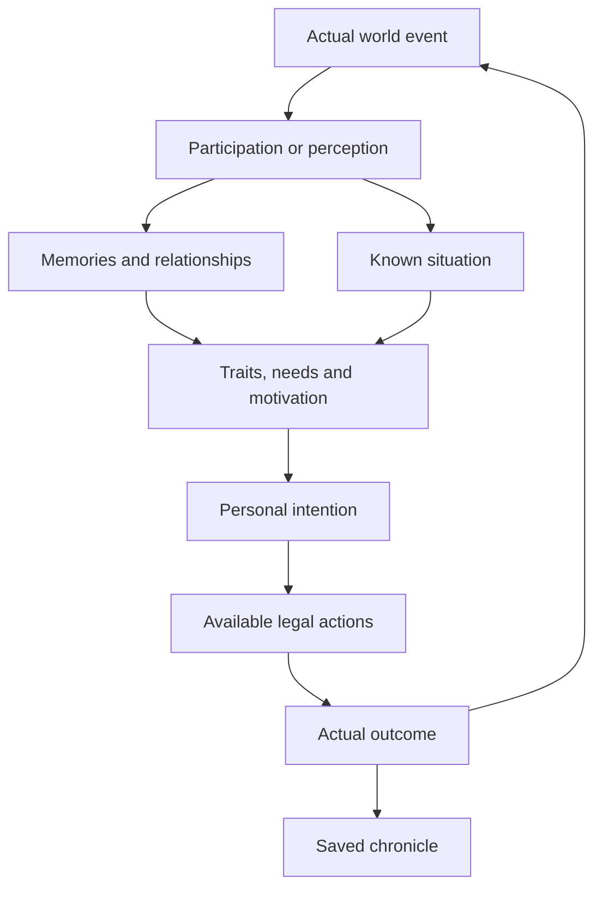

# Trait-driven NPC intentions

The first implementation connects perceived events and survival needs to
persistent intentions and real AI actions. It uses the existing personality,
relationship, action and chronicle systems. The later parts of the design below
are planned; they are not implemented by this first stage.

## The system as a whole

Traits determine which goals are attractive and which reactions and methods an
NPC prefers. Hunger, danger, relationships, resources and commitments influence
whether the actor can pursue a goal now. A situation may produce different goals
for its participants: the hungry person asks for aid, the recipient considers
helping, and either can give up when circumstances change. The player can
intervene, but an episode can proceed without the player.

An intention is private. During gameplay the player sees a person approach,
speak, give food, fight or leave their group. Internal scores, intended actions
and another person's memories are not added to inspection screens. Read Records
provides retrospective access to the saved story outside gameplay.

## Implemented situations

CivilianAI, GangAI, SoldierAI and CHARGuardAI participate when NPC traits and
memories are enabled. Intelligent living actors with these controllers can act;
the player can be a target. Undead, the player controller and other AI controllers
do not generate autonomous intentions.

| Situation | Possible intention | Observable action |
| --- | --- | --- |
| Received needed aid | Repay the helper | Thanks, approach the last known location, give one food unit |
| Hungry with no usable food | Ask a visible nonenemy for food | Approach, speak, wait for a response |
| Received a food request | Help the requester | Give one food unit if supplies permit |
| Food request does not produce a help intention | Decline | Speak a refusal; the requester records the known outcome |
| Attacked by the current leader, or witnessed that leader murder someone | Leave an unsafe group | Leave the actual follower list and clear the leader's order |

Compassion and trade preferences influence repayment and assistance. Group and
trade preferences influence asking. Group preference, courage, personal attitude
and accumulated leader trust influence departure. No single trait guarantees an
outcome: effects from all current traits are combined.

Acknowledgements also use traits: a selfish character can say “About time,” a
solitary one gives a brief thanks, and others address the helper by name. Speech
is a real action with an AP cost. A refusal is published after it is spoken.

Refusal, leaving an unsafe group and losing a companion create personal
memories. Their eventual outcomes use existing eligible advanced traits
(`mistrustful`, `hermit`, `protector`) or skill levels. Relationship histories keep
the resolved memories. Leaving voluntarily has its own `left_group` event;
existing abandonment events retain their original meaning.

### Motivation and timing

Scores use integer arithmetic:

`base + relationWeight * attitude / 2 + sum(traitBias * numerator / denominator)`

Attitude is the existing combined person/group/faction assessment. During
pursuit, target attitude and position are refreshed only when the target is
visible. Current traits still change motivation when the target is unseen.
Departure additionally subtracts a leader-trust penalty from 0 to 60.

| ID | Base / threshold | Trait contributions | Deadline | Cooldown from creation |
| --- | --- | --- | --- | --- |
| `repay_aid` | 25 / 20 | Compassion + Trade | 2 days | 1 day |
| `request_food` | 35 / 20 | Group + Trade / 2 | 60 turns | 180 turns |
| `answer_food_request` | 25 / 20 | Compassion + Trade | 60 turns | 60 turns |
| `leave_unsafe_group` | 40 / 55 | −Group − Courage / 2 | 1 day | 1 day |

The first three use relation weight +1; departure uses −1. One game hour is
30 turns and one day is 720 turns. Request target choice also considers visible
distance and prefers the current leader, without examining others' inventories.

### Real execution and limits

- Each NPC keeps at most four unfinished intentions, one per definition, and
  twelve retained intentions in total. Old terminal intentions may leave this
  short list; their chronicle entries remain.
- Highest current motivation selects the next intention. Creation sequence
  breaks ties. Selection and execution do not use a new random roll.
- Statuses are active, paused, waiting, completed, failed and abandoned. Danger,
  explicit orders, fatigue and a donor's hunger pause ordinary social goals.
  Existing combat, medical care, eating and rest decisions retain priority.
- Departure can override an order from the unsafe leader; escaping explosives
  has priority. Ordinary goals resume after the interruption if still motivated.
- Food transfer requires adjacency, perception, a nonhostile awake recipient,
  legal inventory capacity and at least two usable, unequipped food units owned
  by the donor. Exactly one unit is transferred, preserving perishability.
  The donor spends one action; the recipient spends no AP. Ground stacks are
  untouched, and inventory acquisition counters reflect the actual transfer.
- A completed food request requires actual food acquisition or an end to
  hunger. Receiving medicine alone does not satisfy it.
- Targets use permanent actor IDs, not names. Pursuit follows a last known
  location through the existing movement behavior on the current map. Unseen
  movement or death does not update the goal remotely. Cross-map pursuit is
  not implemented.
- Failed interaction/path attempts wait eight turns before retrying; eight
  blocked attempts fail the intention. The deadline also advances on map turns
  while an actor sleeps or follows an order.
- A maximum of four pending spoken reactions expire after thirty turns. Helping
  within an existing story does not start a new repayment story, preventing
  endless reciprocal gifts.

## Causality, records and saving

Actual significant events receive session-wide increasing IDs. Derived events
carry a cause ID and story ID. A reply intention inherits the request's story;
new stories use the owner's permanent ID and intention sequence. Private
intention starts and terminal outcomes appear once in the resident's chronicle.
They are not published as perceived world events and do not inflate the
interesting-life score.

Read Records has an **Intentions and outcomes** event category. Its entries show
the template, target, result and story tag; physical events retain the same tag.
This lets a reader search an episode across several residents. Ordinary events
can also carry cause/story metadata without belonging to an intention.

Format 5 saves preserve intention sequence, cause/story IDs, target identity and
name snapshot, last known map/position and attitude, status, deadline, retry
progress, announcement state, outcome, cooldowns and pending reactions. Terminal
intentions release their map reference. They never retain an Actor reference.
The archive stores typed event/cause/story metadata separately from the world
graph, so reading does not resume simulation. See [save-format.md](save-format.md).

Each personality keeps a processed-event cutoff independently of its bounded
observation journal. Replaying an already delivered event ID after memory
resolution, journal eviction or loading cannot generate another reward or goal.
To publish a new occurrence, create a new SignificantEvent; to replay delivery,
retain the original ID.

## Planned next stages

### Knowledge and several participants

Introduce explicit known facts with source, observation turn, confidence and
last known location. Separate participation, witnessing, being told and
inference. Rumors can then travel through real conversations instead of global
knowledge. A search or accusation must rely on facts the acting NPC knows.

Expand situations with role binding, resources, locations and independent
participant goals. A dispute over supplies, rescue, search for a missing person
or retaliation can be one story whose actors cooperate or conflict. Stage
changes must follow real outcomes: reaching a location, a transfer, a death or
an agreement. The first implementation links requests and replies by story ID;
it has no general multi-participant story planner yet.

Additional methods can express traits more strongly: appeal to a friend, bargain,
steal, intimidate, recruit help, avoid a feared person or seek reconciliation.
Do not script a successful theft or rescue by writing a record; execute the
existing legal actions and publish what actually happened.

### Groups and world pacing

Introduce stable group identity separate from its leader, then group goals and
faction interests. A group may seek supplies or shelter while its members have
different personal intentions. Trust, fear, attachment, grievance and debt can
eventually coexist instead of being reduced to the current feeling scalar.

A director can limit repeated situations, reserve contested roles/resources and
control the number of concurrent stories. It should select plausible situations
from local knowledge and available actors. Traits still decide participants'
goals and reactions. Event indexes, bounded local work and a saved schedule are
needed before extending this across the whole town; scanning every NPC against
every template on every turn is not the design.

## Adding content

1. Add a stable string ID and definition in
   `WRogue/Gameplay/Personality/NpcIntentContent.cs`. Specify motivation weights,
   threshold, duration and cooldown. Attach event conditions and the target role
   with `.On(...)` before registering the definition. Survival needs may initiate
   goals from the existing local AI perception path instead.
2. Reuse an existing execution method where possible. For a new method, add its
   legal action and real state change, then publish an outcome after that change.
   Keep current perception, interruption and retry rules explicit.
3. Register meaningful acquired memories through the personality registry.
   Check which participant owns each memory and relationship; avoid starting
   memories for events that can only happen during the game.
4. Add named deterministic scenarios for different traits, actual AI actions,
   an invalid/boundary case, perception, and save/load continuation. Register new
   production C# files in the original Windows project too.

## Verification

Scenarios: `npc/intent-gratitude`, `npc/intent-food-request`,
`npc/intent-refusal`, `npc/intent-departure`, `npc/intent-boundaries`,
`npc/intent-knowledge`, `npc/intent-priority`, `npc/intent-controllers`,
`npc/intent-persistence` and `world/records-browser`. They exercise actual
controllers/actions, item/AP accounting, observation boundaries, trait changes,
interruption, replay deduplication, private memory outcomes and format-5 saves.

Run named scenarios with `sh tests/scenario.sh <name>`, then
`docker build --target test .` and `bash tests/e2e.sh`. The E2E script creates an
isolated Compose project and exercises the new record category through VNC.
