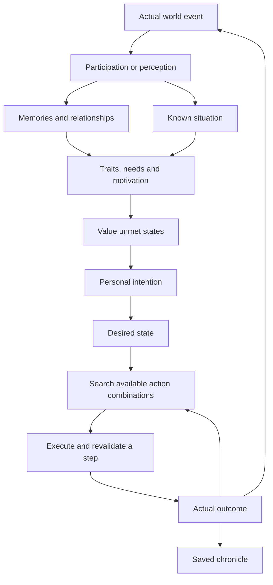

# Trait-driven NPC intentions

The system connects local knowledge, perceived events and survival needs to
persistent intentions, generated desired states, action plans and real AI actions. It includes
personal goals, spoken reports, searches, shared group episodes and a bounded story director. It uses
the existing personality, relationship, action and chronicle systems.

Goals now compose registered operators by their conditions and effects. An
NPC can maintain a lasting interest in food reserves, a chosen shelter, a
person's safety or repairing trust, then respond again when circumstances
change. Group and faction coordinators can propose supply, medicine and
protection tasks to visible eligible allies. Faction tasks do not change
follower membership. These are outcomes of needs, traits and known evidence,
not a fixed sequence of plot scenes.

## The system as a whole

Traits determine which goals are attractive and which reactions and methods an
NPC prefers. Hunger, danger, relationships, resources and commitments influence
whether the actor can pursue a goal now. A situation may produce different goals
for its participants: the hungry person asks for aid, the recipient considers
helping, and either can give up when circumstances change. The player can
intervene, but an episode can proceed without the player.

Threats invite a trait-dependent reply; an apology may be accepted or refused.
Defending someone and retaliation use ordinary melee rules, including actual
damage and death. A leader can expel a known dangerous follower, changing
membership immediately. Failed or unseen actions do not count as completed
intentions. Successful acts produce private memories and saved events.

An intention is private. During gameplay the player sees a person approach,
speak, give food, fight or leave their group. Internal scores, intended actions
and another person's memories are not added to inspection screens. Read Records
provides retrospective access to the saved story outside gameplay.

V starts a short exchange with a nearby person (or selects one by direction
when several are adjacent). A person with a fresh fact can report it. Spoken
rumors and requests are audible without line of sight, within the listener's
audio range; an unseen speaker is unnamed in the player's message log. NPCs who
actually hear a rumor can learn it as hearsay, not as a witnessed event. Read
Records stores the exact rumor, request or reply an awake NPC heard, including
causal and story IDs when the speaker had them. Deaf, sleeping and distant
residents receive no heard-speech entry.
J opens the player's bounded journal of spoken rumors, requests and replies they
actually heard. Unseen speakers remain anonymous there. The journal survives
saving, while Shift+I lists people met through chat or a completed trade even
when the relationship is still neutral. Read Records records measurable positive
trait contributions to a generated goal's importance at goal start; it never
labels unrelated actions as caused by that trait.
Public food, medicine and restitution requests also reach audible NPCs as
hearsay, so their later goals can respond to a need they heard through a wall.

When an NPC asks the player or another person for food, medicine or
compensation, an audible player can later talk to that NPC and answer Y or N.
Y records a time-limited promise linked to the request;
giving the promised resource later fulfils it. N records a refusal and can
change the requester's opinion or plan. Esc leaves the request pending for a
short time. The request event's `PlayerReply` contract supplies the prompt,
phrases and outcomes, so the conversation action needs no event-kind branches.

## Generating goals from state

`NpcGoalGenerator` evaluates current needs, bounded personal knowledge and
relationships. It does not receive a significant-event kind. Observation and
conversation adapters in `NpcKnowledgeSystem` first update beliefs about a
person's food need, danger or unaddressed wrongdoing, with time, confidence and
actual causal IDs. The same perceived condition can come from different sources.
Looking at a visible enemy establishes risk without inventing an attack.
Independent danger and wrongdoing confidence prevent later sight of a person
from turning an uncertain accusation into witnessed evidence.

The generator binds desirable states to known subjects and available execution
capabilities. It records current/desired values, normalized deficit, importance,
confidence and expected utility. No new event is required: hunger, injury, an
existing debt or lost contact can already make a state worth improving.

All arithmetic is integer:

`utility = deficit * importance * confidence / 10000`

Deficit and confidence are clamped to 0..100 and importance to 0..200. Utility
must reach 20 for an autonomous goal. The strongest eligible states are admitted
first; their stable value/subject keys break ties. Existing goal scores are
refreshed before action selection. Changed traits, needs and knowledge can
change the preferred result as well as the method used to achieve it.

| Value | Desired improvement | Importance inputs |
| --- | --- | --- |
| Nutrition | The hungry owner has usable food | Survival need |
| Recovery | The owner reaches their actual maximum HP | Supplies and courage |
| Care | A known person with a credible food need receives food | Compassion, attachment, feeling, group preference and reluctance to give |
| Reciprocity | Reduce a known debt by one food gift's contribution | Compassion, trade and feeling |
| Safety | Withdraw from a remembered nearby danger | Courage and fear |
| Justice | Communicate a boundary about known unaddressed misconduct | Law, courage and grievance |
| Belonging | Restore contact with a known missing group member | Group preference, compassion, attachment and feeling |
| Autonomy | Leave membership under a known dangerous leader | Group preference, courage and leader trust |
| Medical care | Meet another person's known treatment need | Compassion, attachment and known attitude |
| Commitment | Deliver the resource personally promised | Law, compassion and known attitude |
| Restitution | Compensate an outstanding food loss | Law, compassion and known attitude |
| Possession | Recover a valued model or specific owned item | Supplies and an established preference |
| Home | Return to a personally attached threatened place | Group preference and supplies |

These values and game actions are authored mechanics. Subjects, current
shortfalls, importance, competing desires and action sequences are bound during
play. The stable intention IDs remain execution/record labels; their former
event triggers and the attack/murder situation-to-goal table have been removed.
Explicit spoken group assignments still create actual commitments and use their
existing acceptance rules.

Each value/subject pair has its own saved cooldown, allowing two aid goals for
different people even when their names match. At most four goals are active and
twelve are retained. When all four slots are occupied, a newly eligible state
with at least ten more utility points can replace the weakest generated goal.
Explicit group commitments are not replacement candidates. Replacement and
abandonment happen at the decision boundary, allowing an action already being
performed to finish its actual outcome first. Legacy cooldowns from loaded or
explicit intentions are respected. Director admission can still reject a goal.

Evaluation uses the owner's state and at most 32 remembered people, producing
at most 192 candidates. It never scans the town or unknown inventories. Food
needs retain their original time/confidence; expired requests, known enemies and
known deaths cannot motivate new aid. Replies in a shared episode defer new
reciprocity goals for one day; existing repayment targets remain stable when a
new debt is incurred. Ordinary combat, eating, medicine use and explicit orders
retain their existing priorities.

Goal starts privately record their state/utility explanation in Read Records.
Generation itself emits no physical event, adds no item and resolves no memory.
State changes can motivate independent goals in other observers: actual theft,
for example, establishes unaddressed wrongdoing that a lawful owner may want to
address. Hostility and immediate combat still determine which actions are legal.

## Observable examples

For resource competition, promises, actual replies, lasting attachments and
connected causal episodes, see [npc-social-stories.md](npc-social-stories.md).

CivilianAI, GangAI, SoldierAI and CHARGuardAI participate when NPC traits and
memories are enabled. Intelligent living actors with these controllers can act;
the player can be a target. Undead, the player controller and other AI controllers
do not generate autonomous intentions.

| Situation | Possible intention | Observable action |
| --- | --- | --- |
| Received needed aid | Repay the helper | Thanks, approach the last known location, give one food unit |
| Hungry with no usable food | Obtain usable food | Collect known supplies, ask someone, or accept a spoken trade offer |
| Wounded with known medicine available | Recover health | Approach and acquire real medicine, then use it with existing medicine rules |
| Received a food request | Help the requester | Give one food unit if supplies permit |
| Food request does not produce a help intention | Decline | Speak a refusal; the requester records the known outcome |
| Receives a food request and prefers trade over charity | Offer an exchange | Speak an offer; exchange two food units for supplies if both inventories permit |
| Attacked by the current leader, or witnessed that leader murder someone | Leave an unsafe group | Leave the actual follower list and clear the leader's order |
| Knows of violence, directly or through a report | Avoid or confront the reported aggressor | Withdraw from the reported location, or approach and speak a warning |
| Has lost contact with a known group member | Search for the companion | Ask people, follow reported locations and known exits, speak on reunion |
| Knows a group member needs food and remembers supplies | Coordinate or perform a supply mission | Propose a task, fetch actual food, give a unit, return and report |
| Knows of a recent threat and a previously visited indoor place | Seek group shelter | Propose shelter; willing members move there independently |
| A group leader dies in sight of eligible followers | Preserve the group under a successor | Change the actual leader/follower hierarchy; retain group identity |

Compassion and trade preferences influence repayment and assistance. Group and
trade preferences influence asking. Group preference, courage, personal attitude
and accumulated leader trust influence departure. No single trait guarantees an
outcome: effects from all current traits are combined.

Acknowledgements also use traits: a selfish character can say “About time,” a
solitary one gives a brief thanks, and others address the helper by name. Speech
is a real action with an AP cost. A refusal is published after it is spoken.

Refusal, leaving an unsafe group and losing a companion create personal
memories. Their eventual outcomes use existing eligible advanced traits
(`mistrustful`, `hermit`, `protector`) or skill levels. Relationship histories keep
the resolved memories. Leaving voluntarily has its own `left_group` event;
existing abandonment events retain their original meaning.

### Explicit intentions, compatibility and timing

The registry still supplies stable execution IDs, durations and cooldowns.
Explicit group assignments and loaded intentions without a generated-state
payload retain the original motivation calculation:

`base + relationWeight * attitude / 2 + sum(traitBias * numerator / denominator)`

Remembered debt adds to repayment, fear to avoidance, grievance to confrontation,
and attachment to searching, each at half its current value. All are integer
scores. Autonomous intentions instead use the state utility above. The same
known situation can motivate a timid person to withdraw and a lawful person to
approach and communicate a boundary. A warning changes no HP and creates no
invented attack or crime.

Attitude is the existing combined person/group/faction assessment. During
pursuit, target attitude and position are refreshed only when the target is
visible. Current traits still change motivation when the target is unseen.
Departure additionally subtracts a leader-trust penalty from 0 to 60.

| ID | Base / threshold | Trait contributions | Deadline | Cooldown from creation |
| --- | --- | --- | --- | --- |
| `repay_aid` | 25 / 20 | Compassion + Trade | 2 days | 1 day |
| `request_food` | 35 / 20 | Group + Trade / 2 | 60 turns | 180 turns |
| `obtain_food` | 35 / 20 | Explore + Supplies − Group / 2 | 180 turns | 180 turns |
| `restore_health` | 40 / 20 | Generated recovery utility | 180 turns | 180 turns |
| `answer_food_request` | 25 / 20 | Compassion + Trade | 60 turns | 60 turns |
| `leave_unsafe_group` | 40 / 55 | −Group − Courage / 2 | 1 day | 1 day |
| `seek_companion` | 20 / 35 | Group + Compassion / 2 | 1 day | 180 turns |
| `avoid_reported_threat` | 20 / 35 | −Courage | 180 turns | 180 turns |
| `confront_reported_aggressor` | 15 / 35 | Courage + Law | 180 turns | 180 turns |
| `gather_group_supplies` | 35 / 30 | Compassion + Supplies + Explore / 2 | 1 day | 180 turns |
| `coordinate_group_supplies` | 20 / 25 | Group + Compassion / 2 | 1 day | 180 turns |
| `seek_group_shelter` | 25 / 35 | Group − Courage / 2 | 180 turns | 180 turns |

Repayment, requests, assistance, search and gathering use relation weight +1;
departure, avoidance and confrontation use −1; coordination, shelter and
autonomous food acquisition use 0.
One game hour is 30 turns and one day is 720 turns. Request target choice also
considers visible distance and prefers the current leader, without examining
others' inventories.

### Real execution and limits

- Each NPC keeps at most four unfinished intentions, one per definition, and
  twelve retained intentions in total. Old terminal intentions may leave this
  short list; their chronicle entries remain.
- Highest current motivation selects the next intention. Creation sequence
  breaks ties. Selection and execution do not use a new random roll.
- Statuses are active, paused, waiting, completed, failed and abandoned. Danger,
  explicit orders, fatigue and a donor's hunger pause ordinary social goals.
  Existing combat, medical care, eating and rest decisions retain priority.
- Departure can override an order from the unsafe leader; escaping explosives
  has priority. Ordinary goals resume after the interruption if still motivated.
- Food transfer requires adjacency, perception, a nonhostile awake recipient,
  legal inventory capacity and at least two usable, unequipped food units owned
  by the donor. Exactly one unit is transferred, preserving perishability.
  The donor spends one action; the recipient spends no AP. Ground stacks are
  untouched, and inventory acquisition counters reflect the actual transfer.
- A completed food request requires actual food acquisition or an end to
  hunger. Receiving medicine alone does not satisfy it.
- The stable `request_food` definition now seeks usable food, rather than a
  successful request action. A refusal invalidates the attempted method; the
  same goal can switch to a pickup, another listener or an offered exchange.
  A refusal stays in personal history even when the food goal later succeeds.
- A helper who witnesses another participant actually feeding the same
  recipient in their shared story can complete its assistance goal. A collector
  can skip duplicate acquisition/delivery and report that observed result.
  Repayment remains a personal obligation. Unseen gifts update no remote goal.
- Targets use permanent actor IDs, not names. Pursuit follows a last known
  location through existing movement behavior. Cross-map routes use only exits
  the NPC has seen, with at most 32 remembered exits and 16 maps in a route
  search. The current exit is checked against its remembered destination before
  use. Unseen movement or death does not update a goal remotely.
- Failed interaction/path attempts wait eight turns before retrying; eight
  blocked attempts fail the intention. The deadline also advances on map turns
  while an actor sleeps or follows an order.
- A maximum of four pending spoken reactions expire after thirty turns. Helping
  within an existing story defers new reciprocity goals for one day, preventing
  an immediate cycle of reciprocal gifts. Existing repayment targets stay stable.

## Causality, records and saving

Actual significant events receive session-wide increasing IDs. Derived events
carry a cause ID and story ID. A reply intention inherits the request's story;
new stories use the owner's permanent ID and intention sequence. Private
intention starts, generated plans and terminal outcomes appear in the
resident's chronicle.
They are not published as perceived world events and do not inflate the
interesting-life score.

Read Records has an **Intentions and outcomes** event category. Its entries show
the goal, target, generated action sequence, result and story tag; physical
events retain the same tag.
This lets a reader search an episode across several residents. Ordinary events
can also carry cause/story metadata without belonging to an intention.
Where a stored cause ID resolves to an earlier archived event, the reader
shows its prose as **Prompted by** for a goal start or **Connected to** for
another entry. These words are searchable. The display uses only recorded
links, so a trait alone does not become a claimed motive.
The browser colors resident names by their archived faction in the list and
timeline. If two residents share a name across factions, that name uses a
neutral color where the text cannot distinguish their identities.
For a shared group plan, the director's terminal story result determines the
group plan's stage. One participant abandoning a goal leaves the group's
destination available to participants whose goals are still active.

Format 5 saves preserve intention sequence, cause/story IDs, target identity and
name snapshot, last known map/position and attitude, status, deadline, retry
progress, announcement state, outcome, cooldowns and pending reactions. Generated
states retain their subject, current/desired values, deficit, importance,
confidence, utility, evaluation turn and desired planner result; per-state
cooldowns retain the same keys after loading. Terminal
intentions release their map references, including plan steps and rejected
bindings. Plans save their desired state, cursor, costs, conditions and effects,
knowledge/trait cache, retry turn and last actual causal event. They never retain
an Actor reference.
The archive stores typed event/cause/story metadata separately from the world
graph, so reading does not resume simulation. See [save-format.md](save-format.md).

Each personality keeps a processed-event cutoff independently of its bounded
observation journal. Replaying an already delivered event ID after memory
resolution, journal eviction or loading cannot generate another reward or goal.
To publish a new occurrence, create a new SignificantEvent; to replay delivery,
retain the original ID.

## Knowledge and conversations

Facts store the original event ID and time, source actor ID, confidence, last
known place, participants and story tag. The sources are participation,
witnessing, being told and inference. Participants receive confidence 100;
witnesses receive 90. Event metadata cannot identify a participant whom the
observer cannot see. People are remembered by permanent IDs, including
namesakes. Seeing someone updates their location at confidence 100.

An NPC can pass a known report to a visible, awake, nonhostile intelligent
listener within four tiles. Speaking spends the speaker's AP. The listener
learns a **report**, rather than receiving a fabricated observation of the
original violence. The original event ID, time and participants survive
retelling; the immediate teller becomes its source. Confidence loses 20 per
retelling, with smaller adjustments for trust and solitary traits, clamped to
0..95. Reports need confidence 40 to be retold and cannot travel beyond three
retellings. An NPC waits 30 turns between autonomous reports and remembers whom
it told. Direct sight at the same or a later observation time takes precedence
over a weaker report, including a report of death.

Perception also remembers food seen on the ground, visited indoor places and
visible exits. A food report can supply a remembered destination, but the real
stack, capacity and legal pickup are checked again on arrival. Inventories of
other people are not inspected to find supplies.

After 30 turns without seeing a known group member, suitable traits can produce
an inference of missing contact and a search goal. This does not reveal where
the companion really is. The searcher asks actual visible people; the respondent
queues a spoken reply based on their own knowledge. Only after that reply does
the searcher receive its position/date/confidence snapshot. A reunion requires
seeing and approaching the actual matching actor. Credible learned death can
end a search without consulting the unseen actor's current state.

Each NPC retains at most 48 facts, 32 people, 16 places, 32 exits and 64
conversation/query deduplication entries. Facts and places expire after two days
from the original observation. Seeing a person refreshes their position in the
bounded list, so a newly seen participant cannot evict someone observed in the
same event. Goal evaluation runs after accepted observations
and before decisions, using these bounded lists. The director continues to pace
complex group proposals independently.

## Groups, faction interests and shared episodes

A group has a permanent identity, member IDs, current leader ID/name and a shared
plan. Its first identity uses the founder's ID in the separate group namespace;
a newly founded group after a split receives a new identity. Nested followers
share their top-level group. Joining, leaving and splitting update the actual
hierarchy and membership; cycles are rejected. Relationships address the group
identity and display its observed leader's name. A witnessed succession updates
the label while preserving previous group experiences.

When an NPC leader dies, an eligible living, awake follower who can see the
leader may succeed them. Group preference, supply preference and leadership
capacity rank candidates; actor identity breaks ties. Surviving followers retain
the same group identity under the successor. The player is not assigned an
autonomous succession action.

Supply plans begin with the leader's knowledge of a member's food request and
a remembered stock containing at least two units. The leader chooses a visible,
motivated collector and speaks the assignment. The collector independently
accepts or speaks a refusal. The spoken assignment shares the leader's remembered
stock snapshot, rather than revealing its current contents. Acceptance creates
a persistent goal: the beneficiary receives food and the coordinator hears a
report. The planner may use existing supplies, a pickup, requested aid or an
offered exchange before the actual one-unit gift and report. An observed gift
by another participant can satisfy delivery. The gift retains the ordinary
donor reserve
and inventory rules. The coordinator has a separate waiting goal: delivery out
of sight does not remotely tell them it succeeded. It completes when the
collector reports back. A departed member cannot execute a stale group task.

Shelter plans require a remembered recent threat and a previously visited indoor
place. Members who hear the proposal independently accept according to their
traits or queue a spoken refusal. Accepted members move to available indoor
tiles at the remembered shelter; the scene completes after all accepted roles
actually arrive. A refusal does not silently move the member or fail every
other participant's goal.

Existing factions contribute to collective choices through registered policy:

| Factions | Supplies | Shelter | Care | Security |
| --- | ---: | ---: | ---: | ---: |
| Army | +15 | +5 | +10 | +25 |
| Police | +15 | +5 | +15 | +25 |
| Bikers, Gangstas | +10 | −5 | 0 | 0 |
| CHAR, Black Ops | +5 | +15 | 0 | 0 |
| Survivors | 0 | 0 | +15 | +10 |
| Others | 0 | 0 | 0 | 0 |

These are additions to personality motivation, not mandatory faction scripts.
A coordinator can also offer a medicine mission to a visible member of the same
faction without making them a follower. New numeric faction/content IDs are not
introduced. There is no omniscient faction controller issuing town-wide missions.

Person relationships keep five additional values, each clamped to 0..100:
trust, fear, attachment, grievance and debt. Needed aid builds trust, attachment
and debt; a gift can repay debt; known violence builds fear and grievance. These
values influence reports and goal methods alongside the existing feeling score.
They are private, and remain distinct from the existing `TrustInLeader` field
that governs explicit follower orders.

New acquired memories cover being told a report, reunion, completing a supply
mission, reaching group shelter and witnessing group succession. They are
triggered by actual conversations/actions and resolve to eligible advanced
traits or existing skill fallbacks. A report memory concerns the teller;
hearing violence does not create a memory of personally witnessing it.

## Director and world pacing

The Session owns a saved director. New personal stories are limited to four concurrently
active episodes per source map; a group or faction proposal can use a fifth local
slot. The global limit is sixteen, with at most eight bound
roles per story. Up to 64 recent stories and 128 cooldown keys are retained;
private archive entries remain available after a director story is evicted.
Repeating the same owner/target template or group proposal has a 180-turn
director cooldown. Local complex proposals share a 15-turn admission interval
per map; each NPC also saves its own next planning/conversation turn.

A group plan reserves its remembered resource location and collector, preventing
another active plan from binding the same resource or actor. Reservations are
released on a terminal result or deadline. Admission and role binding are
protected by the same director lock for concurrent map simulation. The director
works from submitted local situations; it does not scan every resident against
every template or discover unknown targets.

Story stages follow actual events: contact, pickup, delivery, return report,
arrival, reunion or refusal. Personal role results remain independent. A story
record contains identifiers and location snapshots, not references to its
actors. The director's pacing and reservation state survives saves. Terminal
stories, plans and intentions clear their map references, and starting a new
Session clears its old director.

## Generating plans from desired states

`NpcGoalPlanner` performs bounded uniform-cost search over reusable action
definitions. Each action has prerequisites, forbidden facts, expected effects
and a positive cost. `NpcPlanDomain` binds them to the owner's inventory,
remembered places and currently perceived people. The goal describes a result:
usable food, a fed recipient, reported delivery, contact, a warning, safety,
shelter or departure. There is no authored complete action chain for a plot.

Available primitives are travel, pickup, food request, offered barter, food
transfer, delivery report, location question, reunion, warning, retreat, safety
confirmation, entering shelter and leaving a group. Movement uses existing
navigation and remembered exits. Recovery also uses medicine pickup and use.
Trait biases for group preference, compassion,
trade, exploration, supplies, law and courage change action costs. Actual
attitude and leader preference change whom an NPC asks. Supplies in a visibly
claimed foreign base carry remembered risk: lawful actors penalize that method;
rebellious actors may prefer it. Actual theft still uses existing base rules,
observation and consequences.

For example, a sociable hungry NPC may ask a neighbor while a solitary scavenger
collects known food. A helper with only its own reserve can ask a third person
before feeding the original requester. A trade-minded listener can answer with
an exchange offer. A collector who already has spare food can omit fetching
supplies. These choices share goals and primitives instead of separate authored
plot branches. Independent replies and actions carry the original story tag and
the latest actually experienced causal event.

A request predicts potential help; it never gives the requester food. After
speaking, the NPC waits for a response and evaluates actual state again. A
disappeared stack, changed traits, a refusal, an offered exchange or a witnessed
delivery can invalidate a plan. The next plan starts from real observations.
Every returned game action also rechecks legality immediately before execution;
stale actions spend no AP and create no outcome. Generated `goal_plan` entries
remain private during play and appear under **Intentions and outcomes** in
Read Records, separate from physical events.

Barter requires a recent spoken offer addressed to the buyer. The seller must
still have a nonspoiled, unequipped, nonunique food stack of at least three units.
The buyer exchanges one whole eligible nonfood stack for two food units, leaving
the seller a reserve. Existing recipient trade rating and complete capacity in
both inventories are checked before any mutation. Only the buyer spends a turn;
received-unit counters and the `bartered_food` event reflect the real exchange.
The acquired `traded_for_food` memory can resolve to the existing CHARISMATIC
skill; speech alone grants no negotiation experience.

Recovery plans bind remembered healing medicine. Pickup does not change HP;
the existing medicine action consumes the real item and applies the ordinary
healing rules. Successful use emits `treated_wounds` with the active goal's
causal metadata, including when the ordinary urgent medicine behavior acts
before the planner. Partial treatment causes reassessment, rather than writing
predicted full health into state. Vanished visible medicine invalidates its
remembered availability. Acquisition and treatment appear in the Life category.

Each search expands at most 128 states, keeps at most 512 pending states and
returns at most ten steps. A domain contains at most 64 bound actions, 32 place
bindings and eight possible listeners. Failed bindings are avoided for 30 turns,
with at most eight retained failures. Unchanged unsuccessful planning waits
eight turns; new knowledge or changed traits permits reconsideration. These
limits bound work rather than guaranteeing a solution. Planning does not scan
the town or inspect unseen actors' inventories. Actual trade inspects the
recipient's offer only at the interaction.

The director retains admission, pacing and reservation duties. It does not
choose a complete plot or force participants to succeed. Goals and elementary
actions still require authored mechanics; their runtime combinations, people,
causes and outcomes produce the story. Registered actions now include real
defense, retaliation, intimidation, apology and group expulsion. The named deterministic scenarios
under `tests/scenarios/` verify the implementation; they are not NPC plot scripts.

## Adding content

Use a feature module under `WRogue/Gameplay/Npc/Content/<feature>/` and register
it once in `NpcContentDefaults`. See [npc-content-modules.md](npc-content-modules.md)
for the contract reference and a complete extension in one file.

1. Define the valued state and its importance from `NpcMotivation`. A registered
   `INpcGoalSource` offers current/desired values, deficit, confidence and known
   subjects. Perception/report subscriptions update retained beliefs with their
   original evidence age. Common goal lifecycle code handles deduplication,
   satisfaction, cooldowns and terminal cleanup.
2. Register the capability's desired symbolic facts and reusable operator sources;
   the composer selects sources from their effects and prerequisites, then binds
   available operators with conditions, effects and costs. A new
   operator supplies its legal `ActorAction` factory through the catalog;
   new content does not require enum changes or central dispatch branches.
   Publish outcomes only after actual state changes. Shared plans still require
   real communication and director admission/reservations.
3. Register event descriptions/categories, observer-phase callbacks, private
   acquired memories and their outcomes in the same module. Ordinary memories
   and inferred memories share creation/evidence/relationship attribution.
4. Add named scenarios covering actual controller actions, different traits,
   visibility/invalid boundaries and saved continuation. Keep stable content
   IDs and existing serialized type names, register production files in the
   Windows project, and bump the module's catalog revision when changing plan
   parameters without changing IDs.

## Verification

Scenarios: `npc/intent-gratitude`, `npc/intent-food-request`,
`npc/intent-refusal`, `npc/intent-departure`, `npc/intent-boundaries`,
`npc/intent-knowledge`, `npc/intent-priority`, `npc/intent-controllers`,
`npc/intent-persistence`, `npc/story-rumor`, `npc/story-threat-methods`,
`npc/story-search`, `npc/story-group-supplies`, `npc/story-group-shelter`,
`npc/story-group-boundaries`, `npc/story-hidden-source`,
`npc/story-knowledge-boundaries`, `npc/knowledge-death-capacity`, `npc/story-director`,
`npc/story-persistence`, `factions/social-group-succession`,
`factions/npc-faction-plans` and
`world/records-browser`. They exercise actual
controllers/actions, item/AP accounting, observation boundaries, trait changes,
interruption, replay deduplication, private memory outcomes and format-5 saves.

Planner scenarios: `npc/planner-methods`, `npc/planner-replan`,
`npc/planner-refusal-replan`, `npc/planner-chain`, `npc/planner-owned-supplies`,
`npc/planner-barter`, `npc/planner-barter-boundary`, `npc/planner-risk`,
`npc/planner-observed-outcome`, `npc/planner-boundaries` and
`npc/planner-persistence`. These cover different methods for the same goal,
independent causal chains, uncertain replies, changed resources, theft risk,
capacity and stale-action boundaries, bounded search and saved continuation.

Goal-generation scenarios: `npc/goal-state`, `npc/goal-values`,
`npc/goal-reevaluation`, `npc/goal-medicine`, `npc/goal-subjects`,
`npc/goal-persistence`, `npc/goal-boundaries`, `npc/goal-consequence`,
`npc/goal-priority`, `npc/goal-visible-threat` and `npc/goal-beliefs`. They exercise goal creation
without a triggering event, actual observed consequences, trait-dependent
desired results, subject identity, replacement at a full budget, existing
survival priorities, confidence, disabled/sleep boundaries and save continuation.

Composition and long-run scenarios: `npc/operator-composition`,
`npc/collective-extension`, `npc/stockpile-interest`,
`npc/residence-interest-expiry`, `npc/interest-save`,
`npc/intimidation-response`, `npc/reconciliation`,
`npc/reconciliation-refusal`, `npc/group-expulsion`,
`npc/group-protection`, `npc/group-medicine`, `npc/faction-medicine`,
`npc/retaliation` and `npc/long-run-0/1/2`. These exercise registered
extensions, real consequences, invalid boundaries, save continuation and
fourteen-day simulations across three deterministic world variants.

Run named scenarios with `sh tests/scenario.sh <name>`, then
`docker build --target test .`. For startup, UI, input, rendering or asset
changes, run `bash tests/e2e.sh` in its isolated Compose project.
